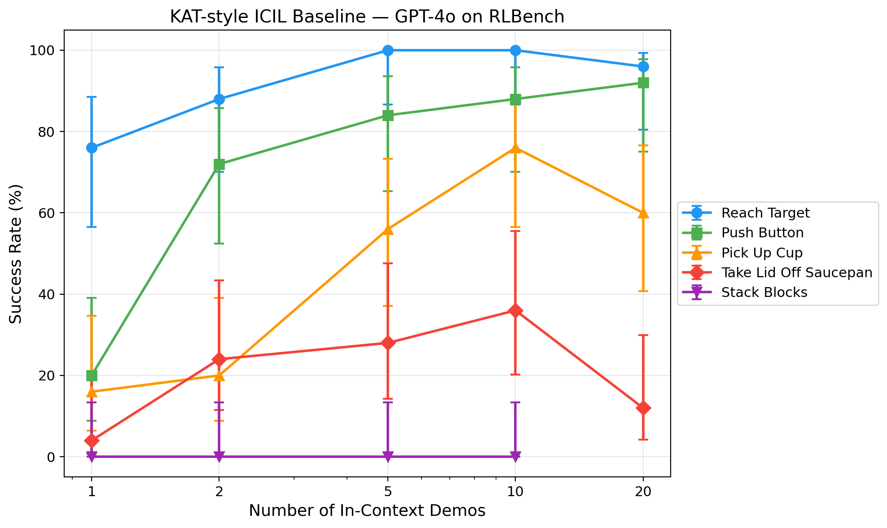

# KAT Baseline — In-Context Imitation Learning on RLBench

A KAT-style (Keypoint Action Tokens) in-context imitation learning baseline. GPT-4o predicts robot action waypoints from demonstration examples in a single API call, executed open-loop in RLBench simulation.

## Results

| Task                    | n=1  | n=2  | n=5  | n=10 | n=20 |
|-------------------------|------|------|------|------|------|
| Reach Target            | 76%  | 88%  | 100% | 100% | 96%  |
| Push Button             | 20%  | 72%  | 84%  | 88%  | 92%  |
| Pick Up Cup             | 16%  | 20%  | 56%  | 76%  | 60%  |
| Take Lid Off Saucepan   | 4%   | 24%  | 28%  | 36%  | 12%  |
| Stack Blocks            | 0%   | 0%   | 0%   | 0%   | —    |

25 trials per cell. Full results in `results/sweep.csv`.



## Quick Start

```bash
ssh nyu-186
source /home/nyuair/anaconda3/etc/profile.d/conda.sh && conda activate kat
export COPPELIASIM_ROOT=~/zhewen/robo/CoppeliaSim_Edu_V4_1_0_Ubuntu20_04
export LD_LIBRARY_PATH=$COPPELIASIM_ROOT:$LD_LIBRARY_PATH
export OPENAI_API_KEY=<your-key>
export QT_QPA_PLATFORM_PLUGIN_PATH=/usr/lib/x86_64-linux-gnu/qt5/plugins/platforms
cd ~/zhewen/robo/KAT

# Smoke test (1 trial, reach_target)
xvfb-run -a python kat_baseline/kat_smoke.py

# Full sweep (625 trials)
xvfb-run -a python kat_baseline/run_sweep.py

# Plot results
python kat_baseline/plot_results.py

# Record episode video
export QT_PLUGIN_PATH=$COPPELIASIM_ROOT && export DISPLAY=:0
python kat_baseline/record_episode.py --task reach_target --n_demos 5 --seed 1002
```

## Structure

```
kat_baseline/
  kat_smoke.py        # Stage 1: single-trial smoke test
  kat_eval.py         # Stage 2: multi-trial evaluation engine
  run_sweep.py        # Stage 3: full task x n_demos sweep
  plot_results.py     # Stage 4: success rate plot with Wilson CIs
  record_episode.py   # Episode video recording
docs/
  project.md          # Detailed project documentation & paper comparison
  prompt/prompt.md    # Original implementation spec
  KAT_paper.pdf       # Original KAT paper (Di Palo & Johns, RSS 2024)
results/
  sweep.csv           # Full experiment results
  results.png/pdf     # Success rate plot
  videos/             # Episode recordings per task
```

## Reference

> Norman Di Palo, Edward Johns. "Keypoint Action Tokens Enable In-Context Imitation Learning in Robotics." RSS 2024. [arXiv:2403.19578](https://arxiv.org/abs/2403.19578)
